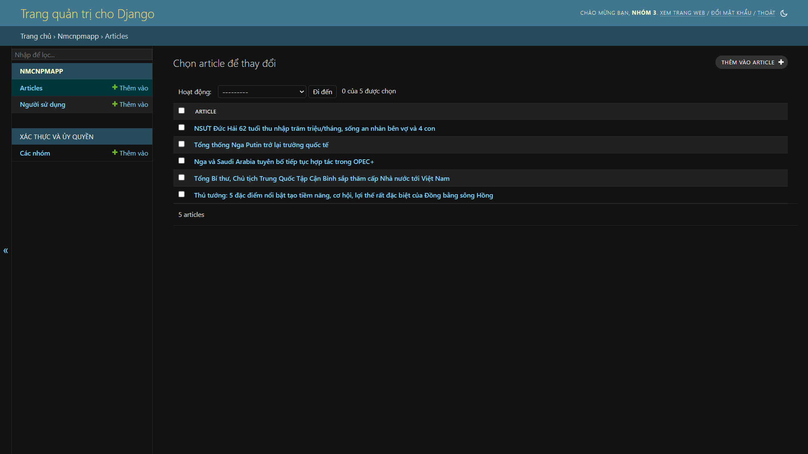

# Bài tập lớn IT3180 - Quản lý thu phí chung cư
TODO!!

## Thành viên nhóm 3
| Thành viên                                        | MSSV     | Vai trò     | Nhiệm vụ                              |
| ------------------------------------------------- | -------- | ----------- | ------------------------------------- |
| [Nguyễn Đăng Phúc]  |  | Trưởng nhóm | Backend, Frontend (Lập trình)         |
| [Vũ Trường An]       |  | Phó nhóm    | Frontend (Thiết kế giao diện)         |
| [Nguyễn Ngọc Kiệt]   |  |             | Frontend (Lập trình), Kiểm thử (Test) |
| [Lê Danh Vinh] |  |             | Frontend (Lập trình)                  |
## Cài đặt (Install & Config)
1. Tải repository
```
git clone https://github.com/vepiot/Quan-Ly-Thu-Phi-Dong-Gop.git
cd Quan-Ly-Thu-Phi-Dong-Gop
```
2. Cài đặt thư viện Django
```
pip install django
python -m django --version
```
Yêu cầu Django phiên bản 4.2.8 trở lên

## Chạy phần mềm trên local (Local Deployment)
Sau khi tải thư viện Django, có thể chạy ứng dụng với lệnh sau:
```
python manage.py runserver
```
Ứng dụng sẽ được chạy local ở [http://localhost:8000](http://localhost:8000) (8000 là port mặc định của Django)

## DEMO 
1. Video giới thiệu sản phẩm [Video DEMO sản phẩm](https://youtu.be/FBIR0gkvZ9A)
2. Sản phẩm demo: [Quản lý thu phí và đóng góp cho Tổ dân phố 7 phường La Khê](https://projectnmcnpm-soict.glitch.me/)
3. Tài khoản thường
Người dùng có thể tự tạo tài khoản ở phần Đăng ký (nhập các thông tin đầy đủ và phải được duyệt thông qua ADMIN để sử dụng bình thường)


4. Tài khoản ADMIN (Đăng nhặp tại [ADMIN](https://projectnmcnpm-soict.glitch.me/admin)):
```
username: admin
password: admin@12345 (mật khẩu mặc định cho các tài khoản user)
```



## Liên hệ (Contact)
Dinh Thai Son: sondinh99999@gmail.com (Trưởng nhóm)
